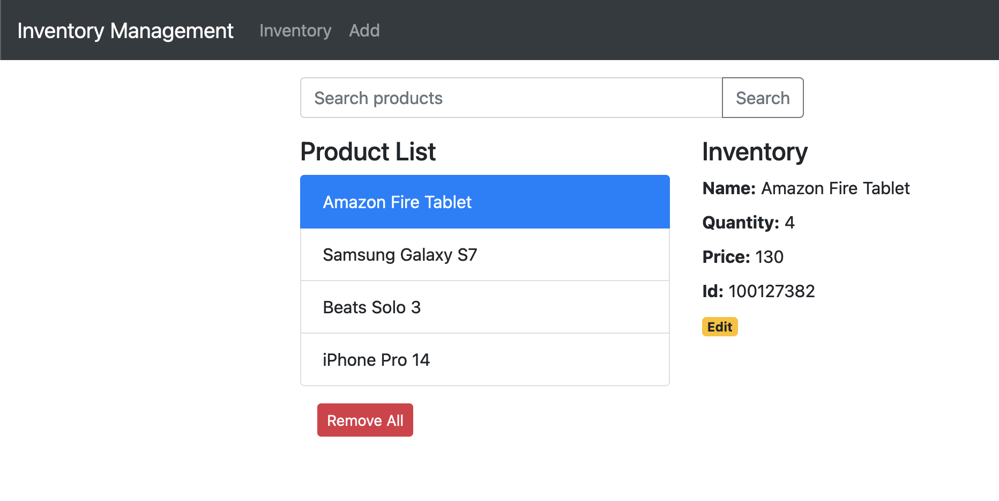

# React.js CRUD App with React Router & Axios

Build a React.js CRUD Application to consume Web API, display and modify data with Router, Axios & Bootstrap.

React Inventory Application in that:
- Each Inventory has a name, quantity, price, and id.
- We can create, retrieve, update, delete Products from the Inventory MySQL Database.
- There is a Search bar for finding Products by name.



Instructions: 

This project was bootstrapped with [Create React App](https://github.com/facebook/create-react-app).

### Set port
.env
```
PORT=8081
```

## Project setup

In the project directory, you can run:

```
npm install
# or
yarn install
```

or

### Compiles and hot-reloads for development

```
npm start
# or
yarn start
```

Open [http://localhost:8081](http://localhost:8081) to view it in the browser.

The page will reload if you make edits.
